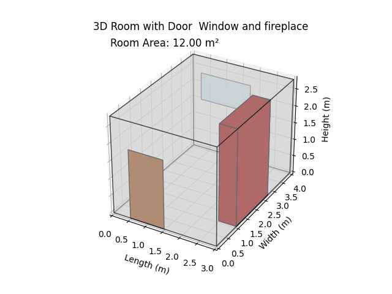

# 🏠 3D Room Visualization with Python

This project creates a 3D representation of a room with a door, window, and fireplace using Python and Matplotlib.

It was born out of a personal motivation to overcome the fear of learning Python by building something visual, practical, and conceptually simple.



---

## 📌 Features

- 3D room generated based on user input dimensions
- Door on the front wall
- Window on the back wall
- Fireplace on the right wall
- Floor area automatically calculated and displayed
- Clean and clear 3D plotting using Matplotlib

---

## 🚀 Getting Started

### 📦 Requirements

- Python 3.x
- Matplotlib
- NumPy

### ▶️ How to Run


1. Install required packages (if needed):
   ```bash
   pip install matplotlib numpy
   ```

2. Run the script.
  

3. Enter your room dimensions when prompted.

---

## 📷 Screenshot


---

## 👤 Author

**Vasileios Tsakalos**  
🔗 [LinkedIn](https://www.linkedin.com/in/vasileios-tsakalos/)  
📁 [GitHub – Tsaqeal](https://github.com/Tsaqeal)

---

## 🚧 Possible Advancements

Here are some ideas for how this project can be improved or expanded:

### 🔄 Enhanced Customization
- Allow **user input to select which wall** (1–4) the **door**, **window**, or **fireplace** appears on.
- Support for **multiple doors or windows** with position, size, and orientation parameters.

### 🪑 Add Interior Objects
- Create **simple 3D objects** like:
  - Tables
  - Chairs
  - Sofas
  - Beds
- Use classes to define objects and **assign them coordinates within the room**.
- Support object placement logic (e.g. don't overlap walls or each other).

### 🎨 Styling & Visualization
- Add **textures or images** to walls/floor (e.g. tiles, wood, wallpaper).
- Improve lighting effects and shading.
- Enable **camera control** or interactive movement using more advanced tools (e.g. Plotly, Blender’s Python API).

### 💾 Save & Export
- Add ability to **export the room as an image or 3D file (e.g. STL or OBJ)**.
- Option to **save/load room layout** from a file (JSON or YAML).

### 🌐 Web Integration
- Convert the tool into a **web app** using Flask or Streamlit for real-time input and rendering.
- Allow people to customize and visualize rooms directly in the browser.

---

Feel free to fork, modify, and contribute!

🙋‍♂️ Author
https://github.com/Tsaqeal
LinkedIn : www.linkedin.com/in/vasileios-tsakalos/
